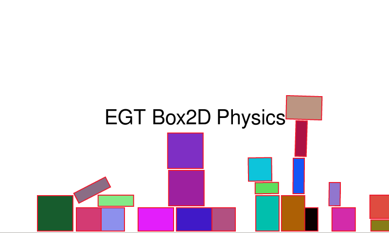
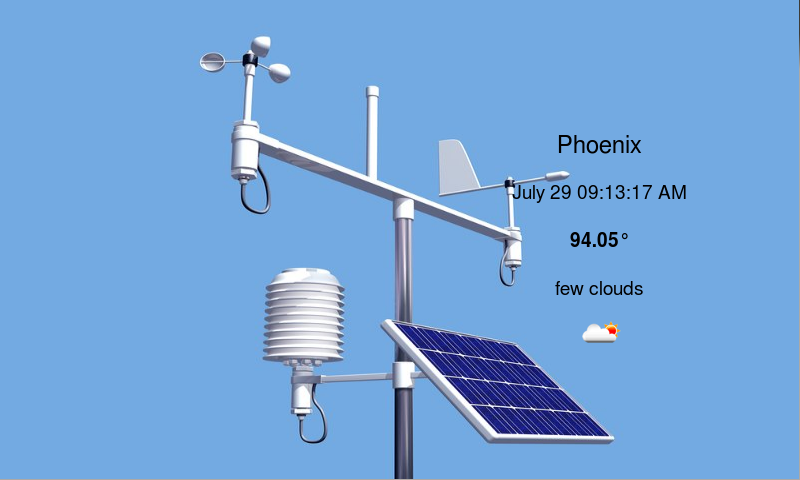

# EGT Sample Applications

Sample applications using and demonstrating the
[Ensemble Graphics Toolkit (EGT)](https://github.com/linux4sam/egt).  These
samples are mostly considered unstable and are for informational purposes.

- animations - simple animations
- chipdrop - interactive Chipmunk2D itegration example
- drop - interactive Box2D integration example
- gallery - navigate a gallery of images
- icon - navigate EGT icons
- infotain - basic infotainment system
- layout - interactively work with layout properies of widgets
- newsfeed - RSS feed reader
- ragdoll - Box2D integration example
- water - sprite animations
- weather - download weather data and images






# Compiling

First compile and install libegt to a directory.

```sh
git clone --recursive https://github.com/linux4sam/egt.git
cd egt
./autogen.sh
./configure --prefix=/opt/egt
make
make install
```

Then, configure and build this samples project.

```sh
git clone --recursive https://github.com/linux4sam/egt-samples.git
./autogen.sh
CXXFLAGS="-I/opt/egt/include/" \
LDFLAGS="-L/opt/egt/lib/" \
PKG_CONFIG_PATH=/opt/egt/lib/pkgconfig \
./configure
make
```

To run an example, set the LD_LIBRARY_PATH environment variable to the library.

```sh
LD_LIBRARY_PATH=/opt/egt/lib ./example
```

## License

Released under the terms of the `Apache 2` license. See the [COPYING](COPYING)
file for more information.
